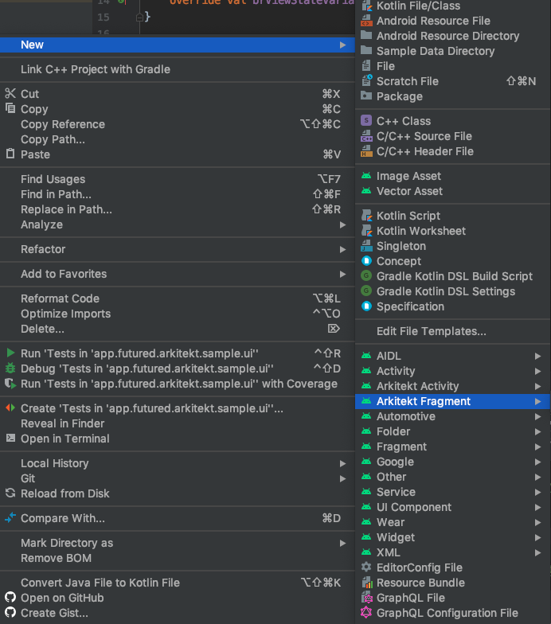

# Arkitekt

[](https://bintray.com/thefuntastyops/arkitekt)
[](https://github.com/futuredapp/arkitekt/actions)

Arkitekt is a framework based on Android Architecture components, which gives you set of
base classes to implement concise, testable and solid application. 

# Installation

[ ](https://bintray.com/thefuntastyops/arkitekt)
```groovy
android {
    ...
    
    dataBinding {
        enabled = true
    }
    
    OR  
    
    buildFeatures {
        dataBinding = true
    }
}
dependencies {
    implementation("app.futured.arkitekt:core:LatestVersion")
    implementation("app.futured.arkitekt:bindingadapters:LatestVersion")
    implementation("app.futured.arkitekt:dagger:LatestVersion")
    implementation("app.futured.arkitekt:cr-usecases:LatestVersion")
    implementation("app.futured.arkitekt:rx-usecases:LatestVersion")
    
    // Testing
    testImplementation("app.futured.arkitekt:core-test:LatestVersion")
    testImplementation("app.futured.arkitekt:rx-usecases-test:LatestVersion")
    testImplementation("app.futured.arkitekt:cr-usecases-test:LatestVersion")
}    
```
# Features

Arkitekt framework combines built-in support for Dagger 2 dependency injection, View DataBinding, ViewModel and RxJava or Coroutines
use cases. Architecture described here is used among wide variety of
projects and it's production ready.


# Usage

## Table of contents

1. [Getting started - Minimal project file hierarchy](#getting-started---minimal-project-file-hierarchy)
2. [Use Cases](#use-cases)
3. [UI changes flow](#ui-changes-flow)
4. [Stores (Repositories)](#stores-repositories)
5. [Templates](#templates)

## Getting started - Minimal project file hierarchy
Minimal working project must contain files as presented in `example-minimal`
module. File hierarchy might looks like this:
```
example-minimal
`-- src/main
    |-- java/com/example
    |   |-- injection  
    |   |   |-- ActivityBuilderModule.kt
    |   |   |-- ApplicationComponent.kt
    |   |   `-- ApplicationModule.kt
    |   |-- ui 
    |   |   |-- base/BaseActivity.kt
    |   |   `-- main
    |   |       |-- MainActivity.kt
    |   |       |-- MainActivityModule.kt
    |   |       |-- MainView.kt
    |   |       |-- MainViewModel.kt
    |   |       |-- MainViewModelFactory.kt
    |   |       `-- MainViewState.kt
    |   `-- App.kt 
    `-- res/layout/activity_main.xml  
```

Keep in mind this description focuses on architecture `.kt` files. Android related files like an 
`AndroidManifest.xml` are omitted. Let's describe individual files one by one:

##### `ActivityBuilderModule.kt` 
File contains Dagger module class that takes responsibility of proper injection
into Activities. This is the place where every Activity and its `ActivityModule` 
in project must be specified to make correct ViewModel injection work.
 
```kotlin
@Module
abstract class ActivityBuilderModule {

    @ContributesAndroidInjector(modules = [MainActivityModule::class])
    abstract fun mainActivity(): MainActivity
}
``` 

##### `ApplicationComponent.kt`

ApplicationComponent interface combines your singleton Dagger modules and defines
how `DaggerApplicationComponent` should be generated.
```kotlin
@Singleton
@Component(
    modules = [
        AndroidInjectionModule::class,
        AndroidSupportInjectionModule::class,
        ActivityBuilderModule::class,
        ApplicationModule::class
    ]
)
interface ApplicationComponent : AndroidInjector<App> {

    @Component.Builder
    interface Builder {

        @BindsInstance
        fun application(app: App): Builder

        fun build(): ApplicationComponent
    }
}
```

##### `ApplicationModule.kt`

Application module definition. Your singleton scoped objects might
be specified here and injected wherever needed. Example implementation:
```kotlin
@Module
class ApplicationModule {

    @Singleton
    @Provides
    fun moshi(): Moshi = Moshi.Builder().build()
}
```

##### `BaseActivity.kt`

All of Activities in the project should inherit from this class to make DataBinding work properly.
Be aware of fact BR class used in this class is generated when there is at least one layout file 
with correctly defined data variables. Read more [here](#activity_mainxml).
```kotlin
abstract class BaseActivity<VM : BaseViewModel<VS>, VS : ViewState, B : ViewDataBinding> :
    BaseDaggerBindingActivity<VM, VS, B>() {

    override val brViewVariableId = BR.view
    override val brViewModelVariableId = BR.viewModel
    override val brViewStateVariableId = BR.viewState
}
```

##### `MainActivity.kt`

Example Activity implementation. `viewModelFactory` and `layoutResId` must be overridden in every
Activity in order to make ViewModel injection and DataBinding work. `ActivityMainBinding` used
in `BaseActivity` constructor is generated from related `activity_main.xml` layout file. Make sure this file
exists and have root tag `<layout>` before you try to build your code. `ViewModel` can be
accessed through derived `viewModel` field.
```kotlin
class MainActivity : BaseActivity<MainViewModel, MainViewState, ActivityMainBinding>(), MainView {

    @Inject override lateinit var viewModelFactory: MainViewModelFactory

    override val layoutResId = R.layout.activity_main
}
```

##### `MainActivityModule.kt`

`MainActivity` scoped module. It becomes useful when you want to provide specific
activity related configuration e.g.:
  
```kotlin
@Module
abstract class MainActivityModule {

    @Provides
    fun provideUser(activity: MainActivity): User = 
            activity.intent.getParcelableExtra("user")
}
```

##### `MainView.kt`

Interface representing actions executable on your Activity/Fragment. These actions
might be invoked directly from xml layout thanks to `view` data variable.  
```kotlin
interface MainView : BaseView
```

##### `MainViewModel.kt`

Activity/Fragment specific ViewModel implementation. You can choose between extending
`BaseViewModel` or `BaseRxViewModel` with build-in support for RxJava based use cases.
```kotlin
class MainViewModel @Inject constructor() : BaseViewModel<MainViewState>() {

    override val viewState = MainViewState
}
```

##### `MainViewModelFactory.kt`

Factory responsible for `ViewModel` creation. It is injected in Activity/Fragment. 
```kotlin
class MainViewModelFactory @Inject constructor(
    override val viewModelProvider: Provider<MainViewModel>
) : BaseViewModelFactory<MainViewModel>() {
    override val viewModelClass = MainViewModel::class
}
```

##### `MainViewState.kt`

State representation of an screen. Should contain set of `LiveData` fields observed
by Activity/Fragment. State is stored in `ViewModel` thus survives screen rotation. 
```kotlin
object MainViewState : ViewState {
    val user = DefaultValueLiveData<User>(User.EMPTY)
}
```

##### `activity_main.xml`

Layout file containing proper DataBinding variables initialization. Make sure correct
types are defined.
```xml
<layout xmlns:android="http://schemas.android.com/apk/res/android">

    <data>
        <variable name="view" type="app.futured.arkitekt.sample.ui.main.MainView"/>
        <variable name="viewModel" type="app.futured.arkitekt.sample.ui.main.MainViewModel"/>
        <variable name="viewState" type="app.futured.arkitekt.sample.ui.main.MainViewState"/>
    </data>

    <LinearLayout
            android:layout_width="match_parent"
            android:layout_height="match_parent"
            android:orientation="vertical"
            android:gravity="center">

    </LinearLayout>
</layout>
```

## Use Cases

Modules `cr-usecases` and `rx-usecases` contains set of base classes useful for easy execution of
background tasks based on Coroutines or RxJava streams respectively. In terms of Coroutines
two base types are available - `UseCase` (single result use case) and `FlowUseCase` (multi result use case).
RxJava base use cases match base Rx "primitives": `ObservableUseCase`, `SingleUseCase`, `FlowableUseCase`, `MaybeUseCase`
and finally `CompletableUseCase`. 

Following example describes how to make an API call and how to deal with 
result of this call. 

##### LoginUseCase.kt
```kotlin
class LoginUseCase @Inject constructor(
    private val apiManager: ApiManager // Retrofit Service
) : SinglerUseCase<LoginData, User>() {

    override fun prepare(args: LoginData): Single<User> {
        return apiManager.getUser(args)
    }
}

data class LoginData(val email: String, val password: String)
```
##### LoginViewState.kt
```kotlin
class LoginViewState : ViewState {
    // IN - values provided by UI
    val email = DefaultValueLiveData("")
    val password = DefaultValueLiveData("")

    // OUT - Values observed by UI
    val fullName = MutableLiveData<String>()
    val isLoading = MutableLiveData<Boolean>()
}
```

##### LoginViewModel.kt
```kotlin
class LoginViewModel @Inject constructor(
    private val loginUseCase: LoginUseCase // Inject UseCase
) : BaseRxViewModel<LoginViewState>() {
    override val viewState = LoginViewState()

    fun logIn() = with(viewState) {
        loginUseCase.execute(LoginData(email.value, email.password)) {
            onStart {
                isLoading.value = true
            }
            onSuccess {
                isLoading.value = false
                fullName.value = user.fullName // handle success & manipulate state
            }
            onError {
                isLoading.value = false
                // handle error
            }
        }
    }
}
```

### Synchronous execution of cr-usecase

Module `cr-usecases` allows you to execute use cases synchronously. 
```kotlin
fun onButtonClicked() = launchWithHandler {  
    ...
    val data = useCase.execute().getOrDefault("Default")  
    ...
}
```
`execute` method returns a `Result` that can be either successful `Success` or failed `Error`.

`launchWithHandler` launches a new coroutine encapsulated with a try-catch block. By default exception thrown in `launchWithHandler` is rethrown but it is possible to override this behavior with `defaultErrorHandler` or just log these exceptions in `logUnhandledException`.

## UI changes flow
There are two main ways how to reflect data changes in UI. Through `ViewState` observation
or one-shot `Events`. 

### ViewState observation

You can observe state changes and reflect these changes in UI via DataBinding 
observation directly in xml layout:

 ```xml
 <layout xmlns:android="http://schemas.android.com/apk/res/android">
 
     <data>
         <variable name="view" type="app.futured.arkitekt.sample.ui.detail.DetailView"/>
         <variable name="viewModel" type="app.futured.arkitekt.sample.ui.detail.DetailViewModel"/>
         <variable name="viewState" type="app.futured.arkitekt.sample.ui.detail.DetailViewState"/>
     </data>
     
     <TextView
             android:layout_width="wrap_content"
             android:layout_height="wrap_content"
             android:text="@{viewState.myTextLiveData}"/>
 </layout>
```

### Events
Events are one-shot messages sent from `ViewModel` to an Activity/Fragment. They
are based on `LiveData` bus. Events are guaranteed to be delivered only once even when
there is screen rotation in progress. Basic event communication might look like this:

##### `MainEvents.kt`
```kotlin
sealed class MainEvent : Event<MainViewState>()

object ShowDetailEvent : MainEvent()
```

##### `MainViewModel.kt`
```kotlin
class MainViewModel @Inject constructor() : BaseViewModel<MainViewState>() {

    override val viewState = MainViewState

    fun onDetail() {
        sendEvent(ShowDetailEvent)
    }
}
```

##### `MainActivity.kt`
```kotlin
class MainActivity : BaseActivity<MainViewModel, MainViewState, ActivityMainBinding>(), MainView {

    // ...

    override fun onCreate(savedInstanceState: Bundle?) {
        super.onCreate(savedInstanceState)

        observeEvent(ShowDetailEvent::class) { 
            startActivity(DetailActivity.getStartIntent(this)) 
        }
    }
}
```

## Stores (Repositories)
All our applications respect broadly known repository pattern. The main message this
pattern tells: Define `Store` (Repository) classes with single entity related business logic 
eg. `UserStore`, `OrderStore`, `DeviceStore` etc. Let's see this principle on `UserStore` class
from sample app:

```kotlin
@Singleton
class UserStore @Inject constructor() {
    private val userRelay = BehaviorRelay.createDefault(User.EMPTY)

    fun setUser(user: User) {
        userRelay.accept(user)
        // ... optionally persist user
    }

    fun getUser(): Observable<User> {
        return userRelay.hide()
    }
}
```

With this approach only one class is responsible for `User` related data access. Besides 
custom classes, Room library `Dao`s or for example Retrofit API interfaces might be 
perceived on the same domain level as stores. Thanks to use cases we can easily access, 
manipulate and combine this kind of data on background threads. 

```kotlin
class GetUserFullNameObservabler @Inject constructor(
    private val userStore: UserStore
) : ObservablerUseCase<String>() {

    override fun prepare(): Observable<String> {
        return userStore.getUser()
            .map { "${it.firstName} ${it.lastName}" }
    }
}
```

We strictly respect this injection hierarchy:

| Application Component | Injects |
| --------- | --------------------- |
| `Activity/Fragment` | `ViewModel` |
| `ViewModel` | `ViewState`, `UseCase` |
| `UseCase` | `Store` |
| `Store` | `Dao`, `Persistence`, `ApiService` |

## Testing

In order to create successful applications, it is highly encouraged to write tests for your application. But testing can be tricky sometimes so here are our best practices and utilities that will help you to achieve this goal with this library. 

See [these tests]([https://github.com/futuredapp/arkitekt](https://github.com/futuredapp/arkitekt/tree/4.x/example/src/)) in `example` module for more detailed sample.

### ViewModel testing

[core-test](#Download) dependency contains utilities to help you with ViewModel testing.

`ViewModelTest` that should be used as a base class for view model tests since it contains JUnit rules for dealing with a live data and with RxJava in tests.

See [these tests]([https://github.com/futuredapp/arkitekt](https://github.com/futuredapp/arkitekt/tree/4.x/example/src/test/java/app/futured/arkitekt/sample/ui/)) in `example` module for more detailed sample of view model testing.

### Events testing

The [spy](https://github.com/mockk/mockk#spy) object should be used for an easy way of testing that expected events were sent to the view.

```kotlin
viewModel = spyk(SampleViewModel(mockViewState, ...), recordPrivateCalls = true)
...
verify { viewModel.sendEvent(ExpectedEvent) }
```
### Mocking of observeWithoutOwner 

When you are using `observeWithoutOwner` extensions then `everyObserveWithoutOwner` will be helpful for mocking of these methods.

So if a method in the view model looks somehow like this:
```kotlin
viewState.counter.observeWithoutOwner { value ->
    viewState.counterText.value = value.toString() 
}
```
then it can be mocked with the following method:
```kotlin
val counterLambda = viewModel.everyObserveWithoutOwner { 
    viewState.counter
}
...
counterLambda.invoke(1) 
```
invoke(...) call will invoke a lambda argument passed to the `observeWithoutOwner` method in the tested method.


### Mocking of Use Cases

Add [rx-usecase-test](#Download) or [cr-usecase-test](#Download) dependencies containing utilities to help you with mocking use cases in a view model.

Since all 'execute' methods for [use cases](#use-cases) are implemented as extension functions, we created testing methods that will help you to easily mock them.

So if a method in the view model looks somehow like this:
```kotlin
fun onLoginClicked(name: String, password: String) {
    loginUseCase.execute(LoginData(name, password)) {
        onSuccess = { ... }
    }
}
```
then it can be mocked with the following method:
```kotlin
mockLoginUseCase.mockExecute(args = ...) { Single.just(user) } // For RxJava Use Cases 
or
mockLoginUseCase.mockExecute(args = ...) { user } // For Coroutines Use Cases
```
In case that use case is using nullable arguments:
```kotlin
mockLoginUseCase.mockExecuteNullable(args = ...) { Single.just(user) } // For RxJava Use Cases
or
mockLoginUseCase.mockExecuteNullable(args = ...) { user } // For Coroutines Use Cases
```

### Activity and Fragment tests

[core-test](#Download) dependency contains utilities to help you with espresso testing.

If you want to test Activities or Fragments then you have few possibilities. You can test them with the mocked implementation of a view model and view state, or you can test them with the real implementation of a view model and view state and with mocked use cases.

Since Fragments and Activities from the dagger module are using AndroidInjection, we created utilities to deal with this.

In your tests, you can use `doAfterActivityInjection` and `doAfterFragmentInjection` to overwrite injected dependencies. These methods are called right after `AndroidInjection` and that allows overwriting of needed dependencies. In the following example, we are replacing the view model with the implementation that is using a view model with mocked dependencies and some random class with mocked implementation.  

```kotlin
doAfterActivityInjection<SampleActivity> { activity ->  
    val provider = SampleViewModel(mockk(), SampleViewState()).asProvider()  
    activity.viewModelFactory = SampleViewModelFactory(viewModelProvider)  
    activity.someInjectedClass = mockk()  
}	
```
See [these tests]([https://github.com/futuredapp/arkitekt](https://github.com/futuredapp/arkitekt/tree/4.x/example/src/sharedTest/java/app/futured/sample/ui)) in `example` module for more detailed samples of espresso test that can be executed as local unit tests or connected android tests.

## Templates  

Arkitekt framework requires several files to be created with each new Activity or Fragment. To make the process of screen creation smooth, our framework is shipped with a template module. It contains templates for creating "Arkitekt Activity" and "Arkitekt Fragment" via Android Studio GUI.

To import templates into Android Studio follow these steps:

**On Mac/Linux**

 1. Add plugin into your project Gradle file
```
plugins {
    id "app.futured.arkitekt.templates" version "LatestVersion"
}
```
 2. Sync Gradle dependencies
 3. Run from your Android Studio terminal 
```
./gradlew copyTemplates
```
 4. Restart Android Studio

Note: You can also run this task from Gradle sidebar in Android Studio, you can find it under
**Tasks -> arkitekt -> copyTemplates**

**On Windows**

 1. Copy folders ArkitektActivity and ArkitektFragment from *arkitekt\templates\src\main\resources\templates* in to  *C:\Program Files\Android\Android Studio\plugins\android\lib\templates\other*
    
 2. Restart/Start Android Studio


**Prerequisites to use templates**
 1. `ConstraintLayout` dependency - Layout generated by template has `ConstraintLayout` as a root.
 2. BaseClasses - `BaseBindingActivity` and `BaseBindingFragment` in package `your.app.pkg.ui.base`.

```kotlin
import androidx.databinding.ViewDataBinding
import app.futured.arkitekt.core.BaseViewModel
import app.futured.arkitekt.core.ViewState
import app.futured.arkitekt.dagger.activity.BaseDaggerBindingActivity
import your.app.pkg.BR

abstract class BaseBindingActivity<VM : BaseViewModel<VS>, VS : ViewState, B : ViewDataBinding> :
    BaseDaggerBindingActivity<VM, VS, B>() {

    override val brViewVariableId = BR.view
    override val brViewModelVariableId = BR.viewModel
    override val brViewStateVariableId = BR.viewState
}
```


```kotlin
import androidx.databinding.ViewDataBinding
import app.futured.arkitekt.core.BaseViewModel
import app.futured.arkitekt.core.ViewState
import app.futured.arkitekt.dagger.fragment.BaseDaggerBindingFragment
import your.app.pkg.BR

abstract class BaseBindingFragment<VM : BaseViewModel<VS>, VS : ViewState, B : ViewDataBinding> :
    BaseDaggerBindingFragment<VM, VS, B>() {

    override val brViewVariableId = BR.view
    override val brViewModelVariableId = BR.viewModel
    override val brViewStateVariableId = BR.viewState
}
```

When the templates are in place you can use them directly from GUI


# License
Arkitekt is available under the MIT license. See the [LICENSE file](LICENCE) for more information.

Created with &#x2764; at Futured. Inspired by [Alfonz library](https://github.com/petrnohejl/Alfonz).
