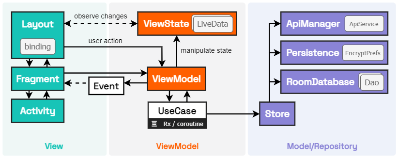

# Arkitekt

[](https://search.maven.org/search?q=app.futured.arkitekt)
[](https://github.com/futuredapp/arkitekt/actions)

Arkitekt is a set of architectural tools based on Android Architecture Components, which gives you a solid base to implement the concise, testable and solid application.

# Installation

```groovy
dependencies {
    implementation("app.futured.arkitekt:core:LatestVersion")
    implementation("app.futured.arkitekt:cr-usecases:LatestVersion")
    implementation("app.futured.arkitekt:compose:LatestVersion")
    implementation("app.futured.arkitekt:arkitekt-decompose:LatestVersion")
    
    // Testing
    testImplementation("app.futured.arkitekt:core-test:LatestVersion")
    testImplementation("app.futured.arkitekt:cr-usecases-test:LatestVersion")
}
```

## Snapshot installation

Add new maven repo to your top level gradle file.

```
maven { url "https://oss.sonatype.org/content/repositories/snapshots" }
```

Snapshots are grouped based on major version, so for version 5.x use:

```groovy
implementation "app.futured.arkitekt:arkitekt:5.X.X-SNAPSHOT"
```

# Features

Arkitekt combines built-in support for Dagger-Hilt dependency injection, ViewModel,
Coroutines use cases, Jetpack Compose, and Decompose. Architecture described here is used among wide variety
of projects and it's production ready.



# Usage

## Table of contents

1. [Getting started - Minimal project file hierarchy](#getting-started---minimal-project-file-hierarchy)
2. [Use Cases](#use-cases)
3. [Propagating data model changes into UI](#propagating-data-model-changes-into-ui)
4. [Stores (Repositories)](#stores-repositories)

## Getting Started - Minimal project file hierarchy
Minimal working project must contain files as presented in `example`
module. File hierarchy might look like this:
```
example
`-- src/main
    |-- java/com/example
    |   |-- ui 
    |   |   |-- main
    |   |   |   `-- MainActivity.kt
    |   |   `-- home
    |   |       |-- HomeScreen.kt
    |   |       |-- HomeViewModel.kt
    |   |       `-- HomeViewState.kt
    |   `-- App.kt 
    `-- res/values/strings.xml  
```

Let's describe individual files one by one:

##### `App.kt`
Application class must be annotated with `@HiltAndroidApp` to trigger Hilt code generation.

```kotlin
@HiltAndroidApp
class App : Application()
``` 

##### `MainActivity.kt`

Activity must be annotated with `@AndroidEntryPoint`. We use `setContent` to define the UI using Jetpack Compose.

```kotlin
@AndroidEntryPoint
class MainActivity : BasicActivity() {

    override fun onCreate(savedInstanceState: Bundle?) {
        super.onCreate(savedInstanceState)
        setContent {
            ArkitektTheme {
                 // Your navigation or screen
                 HomeScreen()
            }
        }
    }
}
```

##### `HomeViewModel.kt`

ViewModel annotated with `@HiltViewModel`. You can choose between extending
`BaseViewModel` or `BaseCrViewModel` (for Coroutines support).

```kotlin
@HiltViewModel
class HomeViewModel @Inject constructor() : BaseViewModel<HomeViewState>() {

    override val viewState = HomeViewState()
}
```

##### `HomeViewState.kt`

State representation of a screen. Should contain a set of `LiveData` (or `StateFlow`) fields observed by the UI.

```kotlin
data class HomeViewState(
    val user: DefaultValueLiveData<User> = DefaultValueLiveData(User.EMPTY)
) : ViewState
```

##### `HomeScreen.kt`

Composable function representing the UI. It obtains the ViewModel via Hilt injection.

```kotlin
@Composable
fun HomeScreen(
    modifier: Modifier = Modifier,
    viewModel: HomeViewModel = hiltViewModel()
) {
    val state = viewModel.viewState.user.observeAsState()
    
    // UI implementation
    Text(
        text = state.value.name,
        modifier = modifier
    )
}
```

## Use Cases

Module `cr-usecases` contains base classes useful for easy execution of
background tasks based on Coroutines. Two base types are available - `UseCase` (single result use case)
and `FlowUseCase` (multi result use case).

Following example describes how to make an API call and how to deal with 
result of this call. 

##### LoginUseCase.kt
```kotlin
class LoginUseCase @Inject constructor(
    private val apiManager: ApiManager // Retrofit Service
) : UseCase<LoginData, User>() {

    override suspend fun build(args: LoginData): User {
        return apiManager.getUser(args)
    }
}

data class LoginData(val email: String, val password: String)
```
##### LoginViewState.kt
```kotlin
class LoginViewState : ViewState {
    // IN - values provided by UI
    val email = DefaultValueLiveData("")
    val password = DefaultValueLiveData("")

    // OUT - Values observed by UI
    val fullName = MutableLiveData<String>()
    val isLoading = MutableLiveData<Boolean>()
}
```

##### LoginViewModel.kt
```kotlin
class LoginViewModel @Inject constructor(
    private val loginUseCase: LoginUseCase // Inject UseCase
) : BaseCrViewModel<LoginViewState>() {
    override val viewState = LoginViewState()

    fun logIn() = with(viewState) {
        loginUseCase.execute(LoginData(email.value, email.password)) {
            onStart {
                isLoading.value = true
            }
            onSuccess {
                isLoading.value = false
                fullName.value = user.fullName // handle success & manipulate state
            }
            onError {
                isLoading.value = false
                // handle error
            }
        }
    }
}
```

### Synchronous execution of cr-usecase

Module `cr-usecases` allows you to execute use cases synchronously. 
```kotlin
fun onButtonClicked() = launchWithHandler {  
    // ...
    val data = useCase.execute().getOrDefault("Default")  
    // ...
}
```
`execute` method returns a `Result` that can be either successful `Success` or failed `Error`.

`launchWithHandler` launches a new coroutine encapsulated with a try-catch block. By default exception thrown in `launchWithHandler` is rethrown but it is possible to override this behavior with `defaultErrorHandler` or just log these exceptions in `logUnhandledException`.

### Global error logger for handled errors in use-cases

In order to set an application-wide error logger for all handled errors in all use-cases, it is possible to set the following method in the `Application` class:

```kotlin
UseCaseErrorHandler.globalOnErrorLogger = { error ->
    CustomLogger.logError(error)
}
```

The `globalOnErrorLogger` callback in the `UseCaseErrorHandler` will be called for every error thrown in all use-cases that have defined onError receiver in the execute method.

The following execute method will trigger `globalOnErrorLogger`:

```kotlin
useCase.execute {
    ...
    onError {
        isLoading = false
    }
    ...
}
```

The following execute method won't trigger `globalOnErrorLogger` because onError is not defined and execute method will throw an unhandled exception.

```kotlin
useCase.execute {}
```

## Propagating data model changes into UI
There are two main ways how to reflect data model changes in UI. Through `ViewState` observation
or one-shot `Events`. 

### ViewState observation

You can observe state changes and reflect these changes in UI by observing `LiveData`
from your `viewState` in your Composable:

```kotlin
@Composable
fun HomeScreen(viewModel: HomeViewModel) {
    val myText by viewModel.viewState.myTextLiveData.observeAsState()
    
    Text(text = myText)
}
```

### Events
Events are one-shot messages sent from `ViewModel` to an Activity/Fragment. They
are based on `LiveData` bus. Events are guaranteed to be delivered only once even when
there is screen rotation in progress. Basic event communication might look like this:

If you are using Jetpack Compose, you can collect these events via `EventsEffect`:
```kotlin
viewModel.EventsEffect {
    onEvent<ShowDetailEvent> { /* handle event */ }
}
```

##### `HomeEvents.kt`
```kotlin
sealed class HomeEvent : Event<HomeViewState>()

object ShowDetailEvent : HomeEvent()
```

##### `HomeViewModel.kt`
```kotlin
class HomeViewModel @Inject constructor() : BaseViewModel<HomeViewState>() {

    override val viewState = HomeViewState

    fun onDetail() {
        sendEvent(ShowDetailEvent)
    }
}
```

## Stores (Repositories)
All our applications respect broadly known repository pattern. The main message this
pattern tells: Define `Store` (Repository) classes with single entity related business logic 
eg. `UserStore`, `OrderStore`, `DeviceStore` etc. Let's see this principle on `UserStore` class
from sample app:

```kotlin
@Singleton
class UserStore @Inject constructor() {
    private val userFlow = MutableStateFlow(User.EMPTY)

    fun setUser(user: User) {
        userFlow.value = user
        // ... optionally persist user
    }

    fun getUser(): Flow<User> {
        return userFlow.asStateFlow()
    }
}
```

With this approach only one class is responsible for `User` related data access. Besides 
custom classes, Room library `Dao`s or for example Retrofit API interfaces might be 
perceived on the same domain level as stores. Thanks to use cases we can easily access, 
manipulate and combine this kind of data on background threads. 

```kotlin
class GetUserFullNameUseCase @Inject constructor(
    private val userStore: UserStore
) : FlowUseCase<String>() {

    override fun prepare(): Flow<String> {
        return userStore.getUser()
            .map { "${it.firstName} ${it.lastName}" }
    }
}
```

We strictly respect this injection hierarchy:

| Application Component | Injects |
| --------- | --------------------- |
| `Activity/Fragment` | `ViewModel` |
| `ViewModel` | `ViewState`, `UseCase` |
| `UseCase` | `Store` |
| `Store` | `Dao`, `Persistence`, `ApiService` |

## Navigation

Arkitekt supports two modern navigation approaches:

### Native Android Navigation (Jetpack Compose)
You can use the standard Jetpack Navigation component with Compose. 

### Decompose (Kotlin Multiplatform)
For KMP projects or robust state management, `arkitekt-decompose` provides integration with the Decompose library. This allows sharing navigation logic across platforms.

## SavedStateHandle

Arkitekt supports `SavedStateHandle` in `ViewModel` via Hilt standard mechanism. Simply inject `SavedStateHandle` into your `@HiltViewModel`.

```kotlin
@HiltViewModel
class HomeViewModel @Inject constructor(
    private val savedStateHandle: SavedStateHandle
) : BaseViewModel<HomeViewState>() {
    // uses savedStateHandle
}
```

## Testing

In order to create successful applications, it is highly encouraged to write tests for your application. 

See [these tests](https://github.com/futuredapp/arkitekt/tree/5.x/example/src/) in `example` module for more detailed sample.

### ViewModel testing

[core-test](#Download) dependency contains utilities to help you with ViewModel testing.

`ViewModelTest` can be used as a base class for view model tests inside `core-test` module to help with Coroutines testing.

### Events testing

The [spy](https://github.com/mockk/mockk#spy) object should be used for an easy way of testing that expected events were sent to the view.

```kotlin
viewModel = spyk(SampleViewModel(mockViewState, ...), recordPrivateCalls = true)
...
verify { viewModel.sendEvent(ExpectedEvent) }
```

### Mocking of Use Cases

[cr-usecase-test](#Download) dependency contains utilities to help you with mocking use cases in a view model.

Since all 'execute' methods for [use cases](#use-cases) are implemented as extension functions, we created testing methods that will help you to easily mock them.

So if a method in the view model looks somehow like this:
```kotlin
fun onLoginClicked(name: String, password: String) {
    loginUseCase.execute(LoginData(name, password)) {
        onSuccess = { ... }
    }
}
```
then it can be mocked with the following method:
```kotlin
mockLoginUseCase.mockExecute(args = ...) { user } // For Coroutines Use Cases
```
In case that use case is using nullable arguments:
```kotlin
mockLoginUseCase.mockExecuteNullable(args = ...) { user } // For Coroutines Use Cases
```

### Activity and Fragment tests

If you want to test Activities or Fragments, you can use `@HiltAndroidTest` or standard Compose testing APIs (`createComposeRule`).

```kotlin
@HiltAndroidTest
class MainActivityTest {

    @get:Rule(order = 0)
    var hiltRule = HiltAndroidRule(this)

    @get:Rule(order = 1)
    val composeTestRule = createAndroidComposeRule<MainActivity>()

    @Test
    fun testUI() {
        composeTestRule.onNodeWithText("Hello").assertIsDisplayed()
    }
}
```

# License
Arkitekt is available under the MIT license. See the [LICENSE file](LICENCE) for more information.

Created with &#x2764; at Futured. Inspired by [Alfonz library](https://github.com/petrnohejl/Alfonz).
